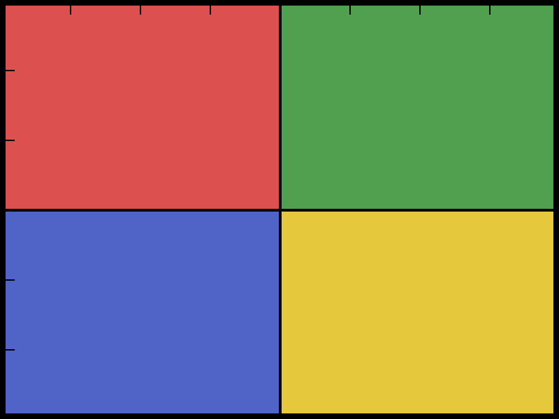

```note
md2pptx の紹介です。このスライド自体が md2pptx で生成されています。
入力は example.md 一枚で、配色とフォントは PowerPoint テーマから来ています。

このテキストは note ブロックで書いた発表者ノートです。
スライド面には出ず、発表者ビューとノート印刷にだけ現れます。
```

## 背景：発表スライド作りの手間

- スライドは「内容」より「体裁」に時間を取られがち
  - 配色・フォントを毎回そろえるのが面倒
  - 図形の位置合わせ・はみ出し調整に終わりがない
- テキストとレイアウトが密結合
  - 中身の差し替えでデザインが崩れる
  - 版管理（差分レビュー）がしにくい

## 課題の整理とアプローチ
<!-- @table-widths: 45,55 -->

体裁はテーマに、内容は Markdown に分離する

| 課題 | md2pptx のアプローチ |
|---|---|
| デザインの一貫性 | PowerPoint テーマに委譲 |
| 記述のしやすさ | Markdown の行頭マーカー記法 |
| レイアウトの自動化 | 種別を見た目から自動判定 |
| はみ出し | 本文サイズへ段階縮小 |

→ 色やフォントはコードに持たず、テーマに委ねる

## md2pptx の特徴

1. テーマ駆動（thmx / pptx の配色・フォントをそのまま使用）
1. 行頭マーカー記法（箇条書き・採番・結論行を自動変換）
1. 表・フロー図・2カラムに対応
1. 本文があふれる場合は自動で段階縮小

## 生成パイプライン

```flow
direction: lr
note(top): テーマと Markdown を入力に pptx を生成
[theme.thmx | テーマ]
-変換-> [base.pptx | 土台]
-描画-> [out.pptx | スライド]
caption: 配色・フォントはテーマ、内容は Markdown
note(bottom): → テーマを差し替えるだけで見た目が一新できる
```

## 行頭マーカー記法

行頭の見た目から段落の種別を自動判定する

| 書き方 | 表示 |
|---|---|
| `- テキスト` | 箇条書き（テーマ既定の記号） |
| `1. テキスト` | 自動採番 1. 2. 3. |
| `① テキスト` | 丸数字採番 ① ② ③ |
| `(1) テキスト` | 丸括弧採番 (1) (2) |
| `→ テキスト` | 行頭記号なしの結論・補足行 |

→ 2スペースで階層、採番＋ネストで見出しと説明

```note
行頭の記号がそのまま段落の種別になります。
ハイフンなら箇条書き、数字なら自動採番、矢印なら記号なしの結論行です。

採番の番号は PowerPoint 側が振るので、途中に行を足しても番号を振り直す必要はありません。
```

## 相対フォントサイズ：要所だけ強調

- {+1} 重要な一行は一段大きく
- 通常の本文はテーマ既定のまま
- {-1} 補足や注記は一段小さく
① {+1} 採番行も同じように調整できる

→ 行頭マーカー直後に {+N} / {-N}（絶対 pt は持たず、テーマの段階内で相対指定）

## スライド全体の調整：@body-size
<!-- @body-size: -1 -->

- 情報量の多いスライドは本文を一律で一段小さく
- 行ごとの {+1} / {-1} はスライド既定より優先
- {0} この行だけテーマ既定へ戻す

→ 全体は小さめ、特定の行だけ元の大きさに

## モジュール構成

1. parser.py
   - Markdown を中間表現（IR）へ変換
2. render.py
   - IR を python-pptx で pptx に描画
3. thmx2pptx.py
   - thmx を土台 pptx に変換
4. flow.py
   - フロー図 DSL の解析と座標計算

## 主な機能
<!-- @autonum-color: tx1 -->

① テーマの配色・フォント・レイアウトを継承
② 表・フロー図・2カラムなど発表向けの部品
③ はみ出し防止の自動縮小で版面に収める

## 比較：手作業 と md2pptx

- 手作業でスライド作成
  - 体裁の調整に時間がかかる
  - デザインがばらつきやすい
  - 差分レビューがしにくい

<!-- @col -->

- md2pptx で生成
  - 内容（Markdown）に集中できる
  - テーマで見た目を統一
  - テキスト差分でレビュー可能

## 画像：ファイル名・サイズ・トリミングを指定

導入：画像も表・図と同じく地の文と一緒に置ける。

{width=60%}

→ `width` / `height` / `crop` / `align` を指定できる（クロップは残す矩形 `x,y,w,h`）

## はみ出しの制御：@overflow
<!-- @overflow: true -->

導入：帯に収めず、あえて大きく見せたいときに使う。

{height=110%}

→ 上端は帯に固定、はみ出すのは下だけ

## まとめ

1. 体裁はテーマ、内容は Markdown に分離
1. 行頭の見た目から段落種別を自動判定
1. 表・フロー図・画像・2カラム・自動縮小に対応
1. 発表者ノートとはみ出し制御も Markdown 側で完結

→ このスライドも md2pptx で生成（入力は example.md）
